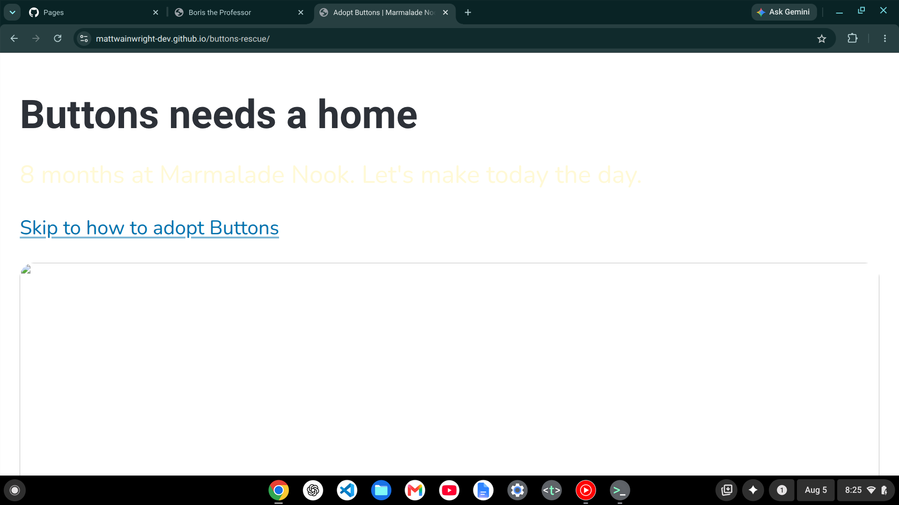
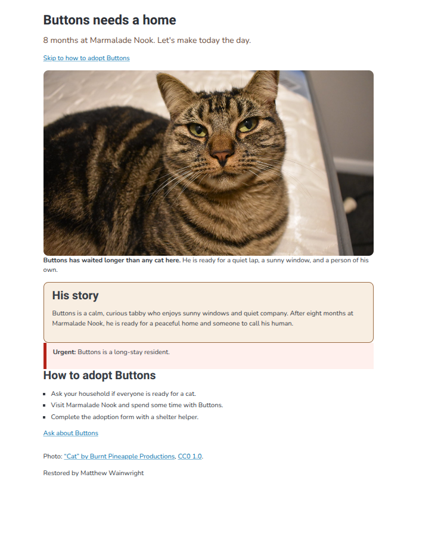

# Buttons' Rescue

The adoption page for Buttons, a long stay cat at Marmalade Nook.

I inherited the page broken, filed each problem as a GitHub issue, and repaired it one fix and one commit at a time.

## Before and after

## What I fixed

- Fixed the broken photo path.
- Stopped the bold text after the intended sentence.
- Repaired the adoption jump link.
- Restored the story box styling.
- Restored the urgent notice styling.
- Darkened the tagline so it is readable.
- Added useful alt text to the photo.
- Wrote Buttons' missing story.

## Credits

Photo: "Cat" by Burnt Pineapple Productions, CC0 1.0.

Live page: https://mattwainwright-dev.github.io/buttons-rescue/
